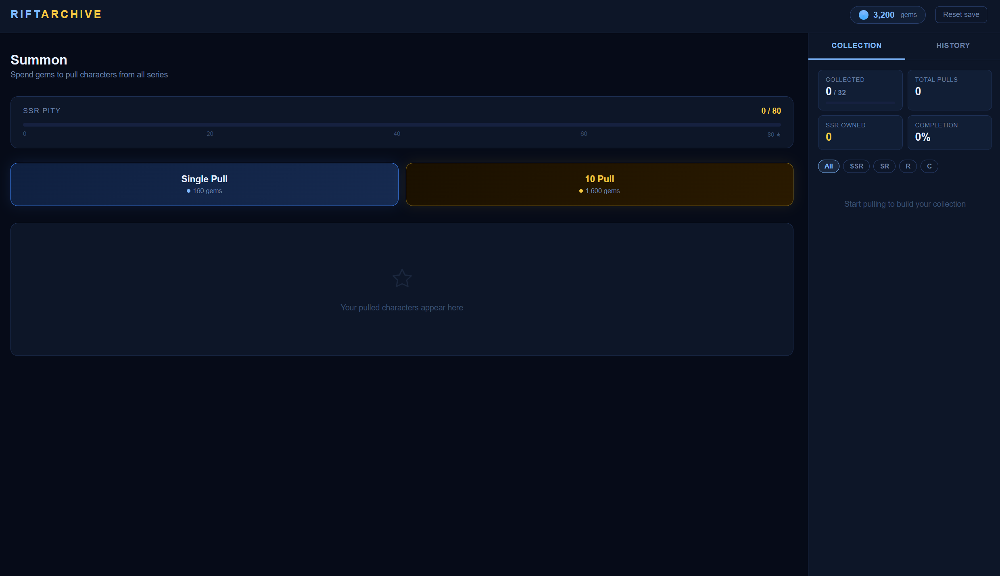
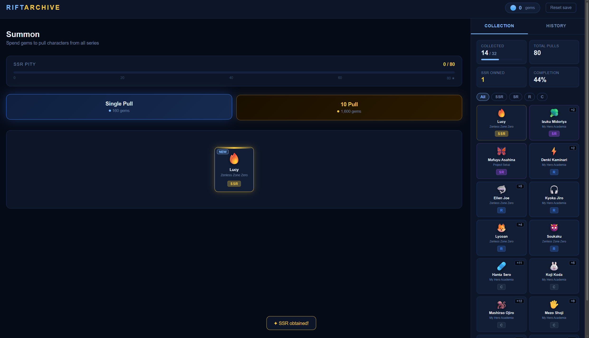
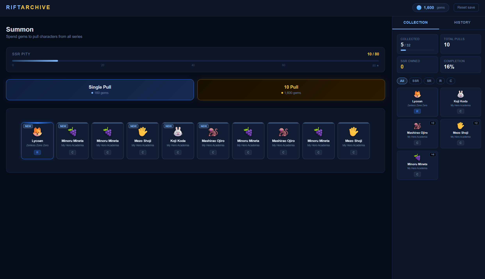

# Rift Archive

Rift Archive is a single-player gacha collection prototype built with HTML, CSS and JavaScript. It was created as a portfolio project to demonstrate game-like frontend systems without relying on a backend, framework or database.

# Screenshots





## Project Description

The app lets players spend gems to pull characters from different rarity pools, build a persistent collection, track pull history and monitor SSR pity progress. Progress is saved locally in the browser using `localStorage`, so the project can be deployed as a simple static site.

This is an unofficial fan-made prototype. Characters and franchises referenced in the demo belong to their respective owners.

## Features

- Single pull and 10-pull summoning
- Rarity-based probability system
- SSR pity system with progress bar
- Gem currency system
- Local save data using `localStorage`
- Inventory with duplicate copy tracking
- Collection completion stats
- Rarity filters
- Pull history
- Top-up modal for testing
- Reset save option
- Toast notifications
- Responsive layout
- Animated card reveals

## Tech Stack

- HTML
- CSS
- JavaScript
- Browser `localStorage`

## How to Run Locally

1. Download or clone the repository.
2. Open `index.html` in your browser.
3. Use the summon buttons to pull characters.

## Project Structure

```text
rift-archive/
├── index.html
├── styles.css
├── script.js
├── screenshots/
│   └── ss1.png
│   └── ss2.png
│   └── ss3.png
└── README.md
```

## What This Project Demonstrates

- Frontend state management
- Weighted random selection
- Game economy logic
- Inventory systems
- Persistent browser storage
- DOM rendering
- UI feedback and animations
- Responsive design
- Clean static deployment workflow

## Future Improvements

Possible future additions:

- Achievements
- Character search
- Series filters
- Character detail pages
- Limited banners
- Import/export save files
- Modular JavaScript file structure
